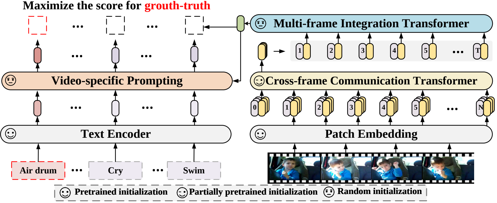
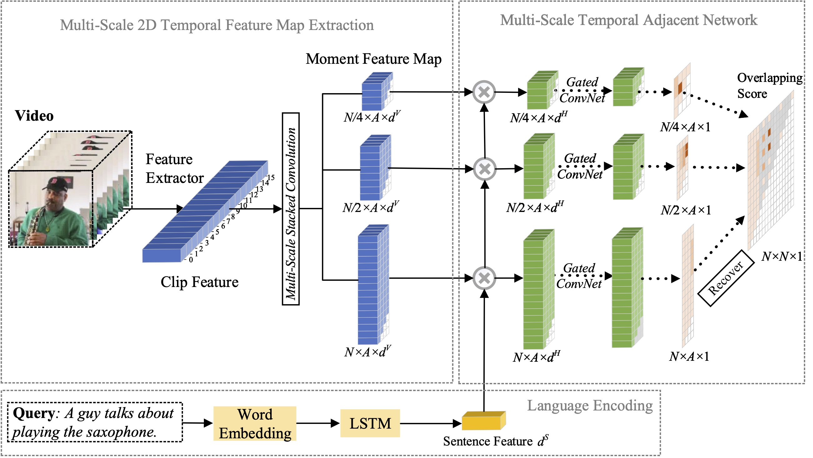
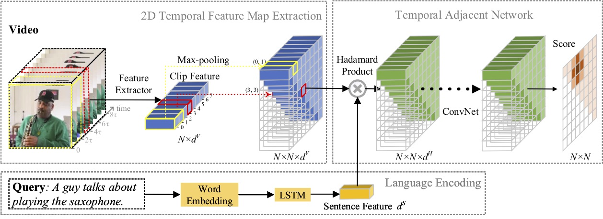

# VideoX - Multi-modal Video Content Understanding [](https://huggingface.co/models?other=xclip) [](https://twitter.com/intent/tweet?text=A%20new%20collection%20of%20video%20cross-modal%20models.&url=https://github.com/microsoft/VideoX&via=houwen_peng&hashtags=Video,CLIP,Video_Text)

***This is a collection of our video understanding work***
> [**SeqTrack**](./SeqTrack) (```@CVPR'23```): **SeqTrack: Sequence to Sequence Learning for Visual Object Tracking**

> [**X-CLIP**](./X-CLIP) (```@ECCV'22 Oral```): **Expanding Language-Image Pretrained Models for General Video Recognition**

> [**MS-2D-TAN**](./MS-2D-TAN) (```@TPAMI'21```): **Multi-Scale 2D Temporal Adjacent Networks for Moment Localization with Natural Language**

> [**2D-TAN**](./2D-TAN) (```@AAAI'20```): **Learning 2D Temporal Adjacent Networks for Moment Localization with Natural Language**

## News

- :sunny: Hiring research interns with strong coding skills at MSRA: houwen.peng@microsoft.com
- :boom: Apr, 2023: Code for [**SeqTrack**](./SeqTrack) is now released.
- :boom: Feb, 2023: [**SeqTrack**](./SeqTrack) was accepted to CVPR'23
- :boom: Sep, 2022: [**X-CLIP**](./X-CLIP) is now integrated into [](https://huggingface.co/models?other=xclip)
- :boom: Aug, 2022: Code for [**X-CLIP**](./X-CLIP) is now released.
- :boom: Jul, 2022: [**X-CLIP**](./X-CLIP) was accepted to ECCV'22 as Oral
- :boom: Oct, 2021: Code for [**MS-2D-TAN**](./MS-2D-TAN) is now released.
- :boom: Sep, 2021: [**MS-2D-TAN**](./MS-2D-TAN) was accepted to TPAMI'21
- :boom: Dec, 2019: Code for [**2D-TAN**](./2D-TAN) is now released.
- :boom: Nov, 2019: [**2D-TAN**](./2D-TAN) was accepted to AAAI'20

## Works

### [SeqTrack](./SeqTrack)

In this paper, we propose a new sequence-to-sequence learning framework for visual tracking, dubbed SeqTrack. It casts visual tracking as a sequence generation problem, which predicts object bounding boxes in an autoregressive fashion. SeqTrack only adopts a simple encoder-decoder transformer architecture. The encoder extracts visual features with a bidirectional transformer, while the decoder generates a sequence of bounding box values autoregressively with a causal decoder. The loss function is a plain cross-entropy. Such a sequence learning paradigm not only simplifies tracking framework, but also achieves competitive performance on many benchmarks.

<div align="center">
    
</div>

### [X-CLIP](./X-CLIP)

In this paper, we propose a new video recognition framework which adapts the pretrained language-image models to video recognition. Specifically, to capture the temporal information, we propose a cross-frame attention mechanism that explicitly exchanges information across frames. To utilize the text information in video categories, we design a video-specific prompting technique which can yield instance-level discriminative textual representation. Extensive experiments demonstrate that our approach is effective and can be generalized to different video recognition scenarios, including fully-supervised, few-shot and zero-shot.

<div align="center">
    
</div>

### [MS-2D-TAN](./MS-2D-TAN)

In this paper, we study the problem of moment localization with natural language, and propose a extend our previous proposed 2D-TAN method to a multi-scale version. The core idea is to retrieve a moment from two-dimensional temporal maps at different temporal scales, which considers adjacent moment candidates as the temporal context. The extended version is capable of encoding adjacent temporal relation at different scales, while learning discriminative features for matching video moments with referring expressions. Our model is simple in design and achieves competitive performance in comparison with the state-of-the-art methods on three benchmark datasets.

<div align="center">
    
</div>

### [2D-TAN](./2D-TAN)

In this paper, we study the problem of moment localization with natural language, and propose a novel 2D Temporal Adjacent Networks(2D-TAN) method. The core idea is to retrieve a moment on a two-dimensional temporal map, which considers adjacent moment candidates as the temporal context. 2D-TAN is capable of encoding adjacent temporal relation, while learning discriminative feature for matching video moments with referring expressions. Our model is simple in design and achieves competitive performance in comparison with the state-of-the-art methods on three benchmark datasets.

<div align="center">
    
</div>

## Bibtex

```bibtex
@InProceedings{SeqTrack,
  title={SeqTrack: Sequence to Sequence Learning for Visual Object Tracking},
  author={Chen, Xin and Peng, Houwen and Wang, Dong and Lu, Huchuan and Hu, Han},
  booktitle={CVPR},
  year={2023}
}

@InProceedings{XCLIP,
  title={Expanding Language-Image Pretrained Models for General Video Recognition},
  author={Ni, Bolin and Peng, Houwen and Chen, Minghao and Zhang, Songyang and Meng, Gaofeng and Fu, Jianlong and Xiang, Shiming and Ling, Haibin},
  booktitle={European Conference on Computer Vision (ECCV)},
  year={2022}
}


@InProceedings{Zhang2021MS2DTAN,
    author = {Zhang, Songyang and Peng, Houwen and Fu, Jianlong and Lu, Yijuan and Luo, Jiebo},
    title = {Multi-Scale 2D Temporal Adjacent Networks for Moment Localization with Natural Language},
    booktitle = {TPAMI},
    year = {2021}
}


@InProceedings{2DTAN_2020_AAAI,
    author = {Zhang, Songyang and Peng, Houwen and Fu, Jianlong and Luo, Jiebo},
    title = {Learning 2D Temporal Adjacent Networks forMoment Localization with Natural Language},
    booktitle = {AAAI},
    year = {2020}
}
```

## License

License under an MIT license.
