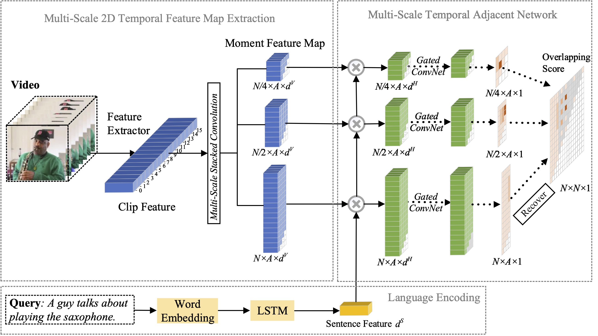

# MS-2D-TAN

In  this  paper,  we  study  the  problem  of  moment  localization  with  natural  language,  and  propose  a  extend our previous proposed  2D-TAN method to a multi-scale version. 
The core idea is to retrieve a moment from two-dimensional temporal maps at different temporal scales, which considers adjacent moment candidates as the temporal context. 
The extended version is capable of encoding adjacent temporal relation at different scales, while learning discriminative features for matching video moments with referring expressions. 
Our model is  simple  in  design  and  achieves  competitive  performance in  comparison  with  the  state-of-the-art  methods  on  three benchmark datasets.


[Arxiv Preprint](https://arxiv.org/abs/2012.02646)

## Framework


## Main Results

### Main results on Charades-STA 
| Feature | Rank1@0.5 | Rank1@0.7 | Rank5@0.5 | Rank5@0.7 |
| ---- |:-------------:| :-----:|:-----:|:-----:|
| VGG | 45.65 | 27.20 | 85.91 | 57.61 |
| C3D | 41.10 | 23.25 | 81.53 | 48.55 |
| I3D | 56.64 | 36.21 | 89.14 | 61.13 |
| I3D* | 60.08 | 37.39 | 89.06 | 59.17 |

(I3D* represents I3D features finetuned on Charades)


### Main results on ActivityNet Captions 
| Feature | Rank1@0.3 | Rank1@0.5 | Rank1@0.7 | Rank5@0.3 | Rank5@0.5 | Rank5@0.7 |
| ---- |:-------------:| :-----:|:-----:|:-----:|:-----:|:-----:|
| C3D | 61.04  | 46.16  | 29.21  | 87.31  | 78.80  | 60.85 |
| I3D | 62.09  | 45.50  | 28.28  | 87.61  | 79.36  | 61.70 |

### Main results on TACoS
| Feature | Rank1@0.1 | Rank1@0.3 | Rank1@0.5 | Rank1@0.7 | Rank5@0.1 | Rank5@0.3 | Rank5@0.5 | Rank5@0.7 |
| ---- |:-------------:| :-----:|:-----:|:-----:|:-----:|:-----:|:-----:|:-----:|
| VGG | 50.64  | 43.31  | 35.27  | 23.54  | 78.31  | 66.18  | 55.81  | 38.09 |
| C3D | 49.24  | 41.74  | 34.29  | 21.54  | 78.33  | 67.01  | 56.76  | 36.84 |
| I3D | 48.66  | 41.96  | 33.59  | 22.14  | 75.96  | 64.93  | 53.44  | 36.12 |

## Prerequisites
- pytorch 1.4.0
- python 3.7
- torchtext
- easydict
- terminaltables


## Quick Start

### Download Datasets

Please download the data from [box](https://rochester.box.com/s/swu6rlqcdlebvwml8dyescmi7ra0owc5) and save it to the `data` folder. 

### Training
Run the following commands for training:
#### Table 1
```
python moment_localization/run.py --cfg experiments/charades/MS-2D-TAN-G-VGG.yaml --verbose --tag base
python moment_localization/run.py --cfg experiments/charades/MS-2D-TAN-G-C3D.yaml --verbose --tag base
python moment_localization/run.py --cfg experiments/charades/MS-2D-TAN-G-I3D.yaml --verbose --tag base
python moment_localization/run.py --cfg experiments/charades/MS-2D-TAN-G-I3D-Finetuned.yaml --verbose --tag base
```
#### Table 2
```
python moment_localization/run.py --cfg experiments/activitynet/MS-2D-TAN-G-C3D.yaml --verbose --tag base
python moment_localization/run.py --cfg experiments/activitynet/MS-2D-TAN-G-I3D.yaml --verbose --tag base
```
#### Table 3

```
python moment_localization/run.py --cfg experiments/tacos/MS-2D-TAN-G-VGG.yaml --verbose --tag base
python moment_localization/run.py --cfg experiments/tacos/MS-2D-TAN-G-C3D.yaml --verbose --tag base
python moment_localization/run.py --cfg experiments/tacos/MS-2D-TAN-G-I3D.yaml --verbose --tag base
python moment_localization/run.py --cfg experiments/tacos/MS-2D-TAN-G-C3D-H512N512K5A8k9L2.yaml --verbose --tag base
python moment_localization/run.py --cfg experiments/tacos/MS-2D-TAN-G-I3D-H512N512K5A8k9L2.yaml --verbose --tag base
```

### Evaluation

Download all the trained model from [box](https://rochester.box.com/s/pvfgay9e90cdvke5qpktewzl99g3l8o9) and save them to the `release_checkpoints` folder.

Then, run the following commands to evaluate our trained models:

#### Table 1
```
python moment_localization/run.py --cfg experiments/charades/MS-2D-TAN-G-VGG.yaml --verbose --split test --mode test
python moment_localization/run.py --cfg experiments/charades/MS-2D-TAN-G-C3D.yaml --verbose --split test --mode test
python moment_localization/run.py --cfg experiments/charades/MS-2D-TAN-G-I3D.yaml --verbose --split test --mode test
python moment_localization/run.py --cfg experiments/charades/MS-2D-TAN-G-I3D-Finetuned.yaml --verbose --split test --mode test
```

#### Table 2
```
python moment_localization/run.py --cfg experiments/activitynet/MS-2D-TAN-G-C3D.yaml --verbose --split test --mode test
python moment_localization/run.py --cfg experiments/activitynet/MS-2D-TAN-G-I3D.yaml --verbose --split test --mode test
```

#### Table 3
```
python moment_localization/run.py --cfg experiments/tacos/MS-2D-TAN-G-VGG.yaml --verbose --split test --mode test
python moment_localization/run.py --cfg experiments/tacos/MS-2D-TAN-G-C3D.yaml --verbose --split test --mode test
python moment_localization/run.py --cfg experiments/tacos/MS-2D-TAN-G-I3D.yaml --verbose --split test --mode test
python moment_localization/run.py --cfg experiments/tacos/MS-2D-TAN-G-C3D-H512N512K5A8k9L2.yaml --verbose --split test --mode test
python moment_localization/run.py --cfg experiments/tacos/MS-2D-TAN-G-I3D-H512N512K5A8k9L2.yaml --verbose --split test --mode test
```


## Citation
If any part of our paper and code is helpful to your work, please generously cite with:
```
@InProceedings{Zhang2021MS2DTAN,
author = {Zhang, Songyang and Peng, Houwen and Fu, Jianlong and Lu, Yijuan and Luo, Jiebo},
title = {Multi-Scale 2D Temporal Adjacent Networks for Moment Localization with Natural Language},
booktitle = {TPAMI},
year = {2021}
} 
```
