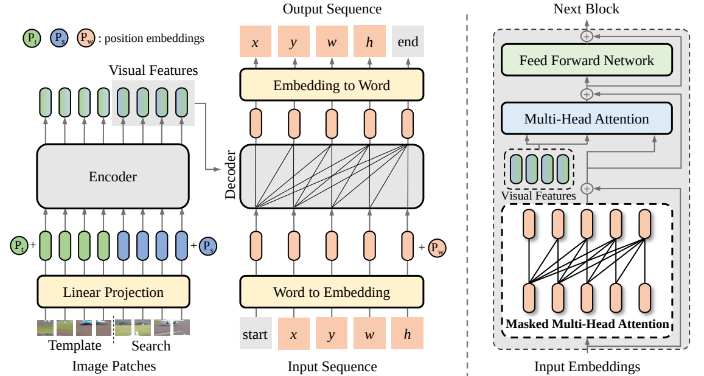

# [CVPR'2023] - SeqTrack: Sequence to Sequence Learning for Visual Object Tracking

[](https://paperswithcode.com/sota/visual-object-tracking-on-tnl2k?p=seqtrack-sequence-to-sequence-learning-for)
[](https://paperswithcode.com/sota/visual-object-tracking-on-lasot?p=seqtrack-sequence-to-sequence-learning-for)
[](https://paperswithcode.com/sota/visual-object-tracking-on-lasot-ext?p=seqtrack-sequence-to-sequence-learning-for)
[](https://paperswithcode.com/sota/visual-object-tracking-on-trackingnet?p=seqtrack-sequence-to-sequence-learning-for)
[](https://paperswithcode.com/sota/visual-object-tracking-on-got-10k?p=seqtrack-sequence-to-sequence-learning-for)
[](https://paperswithcode.com/sota/visual-object-tracking-on-uav123?p=seqtrack-sequence-to-sequence-learning-for)
[](https://paperswithcode.com/sota/visual-object-tracking-on-needforspeed?p=seqtrack-sequence-to-sequence-learning-for)

> [**SeqTrack: Sequence to Sequence Learning for Visual Object Tracking**](https://arxiv.org/abs/2304.14394)<br>
> accepted by CVPR2023<br>
> [Xin Chen](https://scholar.google.com.hk/citations?user=A04HWTIAAAAJ&hl=zh-CN&oi=sr), [Houwen Peng](https://houwenpeng.com/), [Dong Wang](http://faculty.dlut.edu.cn/wangdongice/zh_CN/index.htm), [Huchuan Lu](https://ice.dlut.edu.cn/lu/), [Han Hu](https://ancientmooner.github.io/)


This is an official pytorch implementation of the CVPR2023 paper SeqTrack: Sequence to Sequence Learning for Visual Object Tracking, a new framework for visual object tracking.


## Highlights
### Seq2seq modeling
SeqTrack models tracking as a **sequence generation** task. If the model knows where the target object is, we could simply teach it how to read the bounding box out.


### Simple architecture and loss function
SeqTrack only adopts a **plain encoder-decoder transformer** architecture with a **simple cross-entropy loss**.



### Strong performance
| Tracker      | LaSOT (AUC) | GOT-10K (AO) | TrackingNet (AUC) |
|--------------|-------------|--------------|-------------------|
| **SeqTrack** | **72.5**    | **74.8**     | **85.5**          |
| OSTrack      | 71.1        | 73.7         | 83.9              |
| SimTrack     | 70.5        | 69.8         | 83.4              |
| Mixformer    | 70.1        | 70.7         | 83.9              |

## Install the environment
```
conda create -n seqtrack python=3.8
conda activate seqtrack
bash install.sh
```

* Add the project path to environment variables
```
export PYTHONPATH=<absolute_path_of_SeqTrack>:$PYTHONPATH
```

## Data Preparation
Put the tracking datasets in ./data. It should look like:
   ```
   ${SeqTrack_ROOT}
    -- data
        -- lasot
            |-- airplane
            |-- basketball
            |-- bear
            ...
        -- got10k
            |-- test
            |-- train
            |-- val
        -- coco
            |-- annotations
            |-- images
        -- trackingnet
            |-- TRAIN_0
            |-- TRAIN_1
            ...
            |-- TRAIN_11
            |-- TEST
   ```
## Set project paths
Run the following command to set paths for this project
```
python tracking/create_default_local_file.py --workspace_dir . --data_dir ./data --save_dir .
```
After running this command, you can also modify paths by editing these two files
```
lib/train/admin/local.py  # paths about training
lib/test/evaluation/local.py  # paths about testing
```

## Train SeqTrack
```
python -m torch.distributed.launch --nproc_per_node 8 lib/train/run_training.py --script seqtrack --config seqtrack_b256 --save_dir .
```

(Optionally) Debugging training with a single GPU
```
python tracking/train.py --script seqtrack --config seqtrack_b256 --save_dir . --mode single
```


## Test and evaluate on benchmarks

- LaSOT
```
python tracking/test.py seqtrack seqtrack_b256 --dataset lasot --threads 2
python tracking/analysis_results.py # need to modify tracker configs and names
```
- GOT10K-test
```
python tracking/test.py seqtrack seqtrack_b256_got --dataset got10k_test --threads 2
python lib/test/utils/transform_got10k.py --tracker_name seqtrack --cfg_name seqtrack_b256_got
```
- TrackingNet
```
python tracking/test.py seqtrack seqtrack_b256 --dataset trackingnet --threads 2
python lib/test/utils/transform_trackingnet.py --tracker_name seqtrack --cfg_name seqtrack_b256
```
- TNL2K
```
python tracking/test.py seqtrack seqtrack_b256 --dataset trackingnet --threads 2
python tracking/analysis_results.py # need to modify tracker configs and names
```
- UAV123
```
python tracking/test.py seqtrack seqtrack_b256 --dataset uav --threads 2
python tracking/analysis_results.py # need to modify tracker configs and names
```
- NFS
```
python tracking/test.py seqtrack seqtrack_b256 --dataset nfs --threads 2
python tracking/analysis_results.py # need to modify tracker configs and names
```
- VOT2020  
Before evaluating "SeqTrack+AR" on VOT2020, please install some extra packages following [external/AR/README.md](external/AR/README.md)
```
cd external/vot20/<workspace_dir>
export PYTHONPATH=<path to the seqtrack project>:$PYTHONPATH
vot evaluate --workspace . seqtrack_b256_ar
vot analysis --nocache
```


## Test FLOPs, Params, and Speed
```
# Profiling SeqTrack-B256 model
python tracking/profile_model.py --script seqtrack --config seqtrack_b256
```

## Model Zoo
The trained models, and the raw tracking results are provided in the [model zoo](MODEL_ZOO.md)

## Acknowledgement
* This codebase is implemented on [STARK](https://github.com/researchmm/Stark) and [PyTracking](https://github.com/visionml/pytracking) libraries, also refers to [Stable-Pix2Seq](https://github.com/gaopengcuhk/Stable-Pix2Seq), and borrows [AlphaRefine](https://github.com/MasterBin-IIAU/AlphaRefine) for VOT evaluation. 
We would like to thank their authors for providing great libraries.


