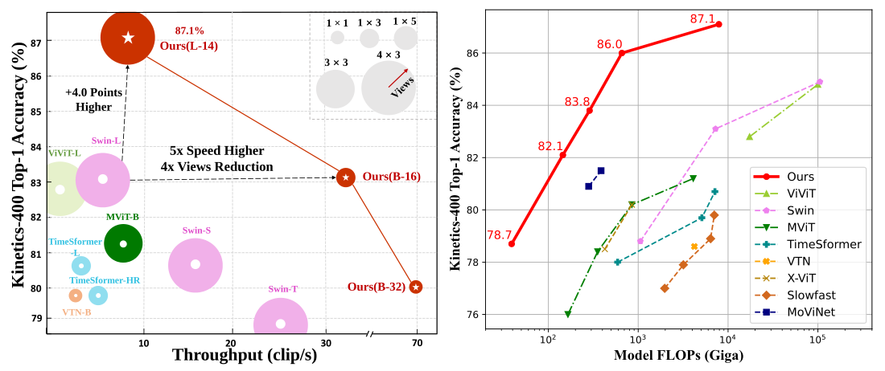

# [ECCV'2022 Oral] - Expanding Language-Image Pretrained Models for General Video Recognition [](https://twitter.com/intent/tweet?text=CLIP%20for%20Video!!&url=https://github.com/microsoft/VideoX/edit/master/X-CLIP&via=houwen_peng&hashtags=CLIP,Kinetics,vision_transformer,zero_shot)

[](https://huggingface.co/models?other=xclip)
[](https://paperswithcode.com/sota/action-classification-on-kinetics-400?p=expanding-language-image-pretrained-models)
[](https://paperswithcode.com/sota/action-classification-on-kinetics-600?p=expanding-language-image-pretrained-models)
[](https://paperswithcode.com/sota/zero-shot-action-recognition-on-kinetics?p=expanding-language-image-pretrained-models)
[](https://paperswithcode.com/sota/zero-shot-action-recognition-on-hmdb51?p=expanding-language-image-pretrained-models)
[](https://paperswithcode.com/sota/zero-shot-action-recognition-on-ucf101?p=expanding-language-image-pretrained-models)
> [**Expanding Language-Image Pretrained Models for General Video Recognition**](https://arxiv.org/abs/2208.02816)<br>
> accepted by ECCV 2022 as an oral presentation<br>
> Bolin Ni, [Houwen Peng](https://houwenpeng.com/), [Minghao Chen](https://silent-chen.github.io/), [Songyang Zhang](https://sy-zhang.github.io/), [Gaofeng Meng](https://people.ucas.ac.cn/~gfmeng), [Jianlong Fu](https://jianlong-fu.github.io/), [Shiming Xiang](https://people.ucas.ac.cn/~xiangshiming), [Haibin Ling](https://www3.cs.stonybrook.edu/~hling/)

[[arxiv]](https://arxiv.org/abs/2208.02816)
[[slides]](https://github.com/nbl97/X-CLIP_Model_Zoo/releases/download/v1.0/xclip-slides.pptx)

This is an official implementation of [X-CLIP](https://arxiv.org/abs/2208.02816), a new framework adapting language-image foundation models to general video recognition. 

- Recognition with closed-set categories
    <table>
        <tr>
            <td ><center></center></td>
            <td ><center></center></td>
            <td ><center></center></td>
        </tr>
    </table>

- Recognition with open-set categories
    <table>
        <tr>
            <td ><center></center></td>
            <td ><center></center></td>
            <td ><center></center></td>
        </tr>
    </table>

# News
- :eyes: [Houwen Peng](https://houwenpeng.com/) is hiring research interns. Contact: [houwen.peng@microsoft.com](houwen.peng@microsoft.com)
- :sparkles: **[Sep, 2022]** The models are now integrated into [](https://huggingface.co/models?other=xclip)
- :sparkles: **[July, 2022]** The code and pretrained models of X-CLIP have been released, including fully-supervised, few-shot and zero-shot settings. Thanks for your star :stuck_out_tongue_closed_eyes:
- :sparkles: **[July, 2022]** Our paper has been accepted by ECCV2022 (**Oral**).


# Highlights
- :muscle: Fast and Accurate

<div align="center">
    
</div>

    
# Environment Setup
To set up the environment, you can easily run the following command:
```
conda create -n XCLIP python=3.7
conda activate XCLIP
pip install -r requirements.txt
```

Install Apex as follows
```
git clone https://github.com/NVIDIA/apex
cd apex
pip install -v --disable-pip-version-check --no-cache-dir --global-option="--cpp_ext" --global-option="--cuda_ext" ./
```

# Data Preparation

For downloading the Kinetics datasets, you can refer to [mmaction2](https://github.com/open-mmlab/mmaction2/blob/master/tools/data/kinetics/README.md) or [CVDF](https://github.com/cvdfoundation/kinetics-dataset). For [UCF-101](https://www.crcv.ucf.edu/data/UCF101.php) and [HMDB-51](https://serre-lab.clps.brown.edu/resource/hmdb-a-large-human-motion-database/), you can easily get them from the official website.

Due to limited storage, we decord the videos in an online fashion using [decord](https://github.com/dmlc/decord).

We provide the following two ways to organize the dataset:

- **Option \#1:** Standard Folder. For standard folder, put all videos in the `videos` folder, and prepare the annotation files as `train.txt` and `val.txt`. Please make sure the folder looks like this:
    ```Shell
    $ ls /PATH/TO/videos | head -n 2
    a.mp4
    b.mp4

    $ head -n 2 /PATH/TO/train.txt
    a.mp4 0
    b.mp4 2

    $ head -n 2 /PATH/TO/val.txt
    c.mp4 1
    d.mp4 2
    ```


-  **Option \#2:** Zip/Tar File. When reading videos from massive small files, we recommend using zipped files to boost loading speed. The videos can be organized into a `tar` file `videos.tar`, which looks like:
    ```Shell
    $ tar -tvf /PATH/TO/videos.tar | head -n 2
    a.mp4
    b.mp4
    ```
    The `train.txt` and `val.txt` are prepared in the same way as option \#1.

Since that our method employs semantic information in text labels, rather than traditional one-hot label, it is necessary to provide a textual description for each video category. For example, we provide the text description of Kinetics-400 in the file `labels/kinetics_400_labels.csv`. Here is the format:
```Shell
$ head -n 5 labels/kinetics_400_labels.csv
id,name
0,abseiling
1,air drumming
2,answering questions
3,applauding
```
The `id` indicates the class id, while the `name` denotes the text description.

# Model Zoo
For evaluation, we provide the checkpoints of our models in the following tables.
- Fully-supervised on Kinetics-400:

    | Model | FLOPs(G)| Input | Top-1 Acc.(%) | Top-5 Acc.(%)| ckpt | log |
    |--|--|--|--|--|--|--|
    | X-CLIP-B/32 | 39 |8x224 |80.4 | 95.0 | [Github](https://github.com/nbl97/X-CLIP_Model_Zoo/releases/download/v1.0/k400_32_8.pth) | [Github](https://github.com/nbl97/X-CLIP_Model_Zoo/releases/download/v1.0/k400_32_8.txt)|
    | X-CLIP-B/32 | 75 |16x224 |81.1 | 95.5 | [Github](https://github.com/nbl97/X-CLIP_Model_Zoo/releases/download/v1.0/k400_32_16.pth) | [Github](https://github.com/nbl97/X-CLIP_Model_Zoo/releases/download/v1.0/k400_32_16.txt) |
    | X-CLIP-B/16 | 145 |8x224 |83.8 | 95.7 | [Github](https://github.com/nbl97/X-CLIP_Model_Zoo/releases/download/v1.0/k400_16_8.pth) | [Github](https://github.com/nbl97/X-CLIP_Model_Zoo/releases/download/v1.0/k400_16_8.txt) |
    | X-CLIP-B/16 | 287 |16x224 |84.7 | 96.8 | [Github](https://github.com/nbl97/X-CLIP_Model_Zoo/releases/download/v1.0/k400_16_16.pth) | [Github](https://github.com/nbl97/X-CLIP_Model_Zoo/releases/download/v1.0/k400_16_16.txt)|
    | X-CLIP-B/14 | 658 |8x224 |87.1 | 97.6 | [GoogleDrive](https://drive.google.com/file/d/1NUOImq0o5DlQTST17iIP3vG7DgmHQuCx/view?usp=sharing) | [Github](https://github.com/nbl97/X-CLIP_Model_Zoo/releases/download/v1.0/k400_14_8.txt)|
    | X-CLIP-B/14 | 3086 |16x336 |87.7 | 97.4 |[GoogleDrive](https://drive.google.com/file/d/1FOYgnJc097OJ4lGwtRCCydQyVPJEOH7d/view?usp=sharing)  |[Github](https://github.com/nbl97/X-CLIP_Model_Zoo/releases/download/v1.0/k400_14_16_336.txt) |

- Fully-supervised on Kinetics-600:

    | Model | FLOPs(G)| Input | Top-1 Acc.(%) | Top-5 Acc.(%)| ckpt | log |
    |--|--|--|--|--|--|--|
    | X-CLIP-B/16 | 145|8x224 |85.3 | 97.1 | [Github](https://github.com/nbl97/X-CLIP_Model_Zoo/releases/download/v1.0/k600_16_8.pth) | [Github](https://github.com/nbl97/X-CLIP_Model_Zoo/releases/download/v1.0/k600_16_8.txt)|
    | X-CLIP-B/16 | 287 |16x224 |85.8 | 97.3 | [Github](https://github.com/nbl97/X-CLIP_Model_Zoo/releases/download/v1.0/k600_16_16.pth) | [Github](https://github.com/nbl97/X-CLIP_Model_Zoo/releases/download/v1.0/k600_16_16.txt) |
    | X-CLIP-L/14 | 658 |8x224 |88.3 | 97.7 | [GoogleDrive](https://drive.google.com/file/d/1FV8C1INuM91sLAN4ImjzePLIlpMSihwV/view?usp=sharing) | [Github](https://github.com/nbl97/X-CLIP_Model_Zoo/releases/download/v1.0/k600_14_8.txt) |

- Few-shot:

    | Model | Dataset | K | FLOPs(G) | Input| Top-1 Acc.(%) | ckpt | log |
    |--|--|--|--|--|--|--|--|
    | X-CLIP-B/16 | HMDB-51 | 2 | 571 | 32x224 |53.0 | [Github](https://github.com/nbl97/X-CLIP_Model_Zoo/releases/download/v1.0/few_hmdb_2.pth) | [Github](https://github.com/nbl97/X-CLIP_Model_Zoo/releases/download/v1.0/hmdb_2.txt)|
    | X-CLIP-B/16 | HMDB-51 | 4 |571 |32x224 |57.3 | [Github](https://github.com/nbl97/X-CLIP_Model_Zoo/releases/download/v1.0/few_hmdb_4.pth) | [Github](https://github.com/nbl97/X-CLIP_Model_Zoo/releases/download/v1.0/hmdb_4.txt) |
    | X-CLIP-B/16 | HMDB-51 | 8 |571 |32x224 |62.8 | [Github](https://github.com/nbl97/X-CLIP_Model_Zoo/releases/download/v1.0/few_hmdb_8.pth) | [Github](https://github.com/nbl97/X-CLIP_Model_Zoo/releases/download/v1.0/hmdb_8.txt) |
    | X-CLIP-B/16 | HMDB-51 |16 |571 |32x224 |64.0 | [Github](https://github.com/nbl97/X-CLIP_Model_Zoo/releases/download/v1.0/few_hmdb_16.pth) | [Github](https://github.com/nbl97/X-CLIP_Model_Zoo/releases/download/v1.0/hmdb_16.txt) |
    | X-CLIP-B/16 | UCF-101 | 2 |571 |32x224 |76.4 | [Github](https://github.com/nbl97/X-CLIP_Model_Zoo/releases/download/v1.0/few_ucf_2.pth) | [Github](https://github.com/nbl97/X-CLIP_Model_Zoo/releases/download/v1.0/ucf_2.txt)|
    | X-CLIP-B/16 | UCF-101 | 4 |571 |32x224 |83.4 | [Github](https://github.com/nbl97/X-CLIP_Model_Zoo/releases/download/v1.0/few_ucf_4.pth) | [Github](https://github.com/nbl97/X-CLIP_Model_Zoo/releases/download/v1.0/ucf_4.txt) |
    | X-CLIP-B/16 | UCF-101 | 8 |571 |32x224 |88.3 | [Github](https://github.com/nbl97/X-CLIP_Model_Zoo/releases/download/v1.0/few_ucf_8.pth) | [Github](https://github.com/nbl97/X-CLIP_Model_Zoo/releases/download/v1.0/ucf_8.txt) |
    | X-CLIP-B/16 | UCF-101 | 16 |571 |32x224 |91.4 | [Github](https://github.com/nbl97/X-CLIP_Model_Zoo/releases/download/v1.0/few_ucf_16.pth) | [Github](https://github.com/nbl97/X-CLIP_Model_Zoo/releases/download/v1.0/ucf_16.txt) |

- Zero-shot:
  | Model | Dataset | FLOPs(G)| Input | Top-1 Acc.(%) | ckpt | log |
  |--|--|--|--|--|--|--|
  | X-CLIP-B/16 | HMDB-51 |571|32x224 | 44.6 | [Github](https://github.com/nbl97/X-CLIP_Model_Zoo/releases/download/v1.0/zero.pth) | [Github](https://github.com/nbl97/X-CLIP_Model_Zoo/releases/download/v1.0/zero.txt)|
    | X-CLIP-B/16 | UCF-101 |571|32x224 | 72.0 | [Github](https://github.com/nbl97/X-CLIP_Model_Zoo/releases/download/v1.0/zero.pth) | [Github](https://github.com/nbl97/X-CLIP_Model_Zoo/releases/download/v1.0/zero.txt) |
    | X-CLIP-B/16 | Kinetics-600 |571|32x224 | 65.2 | [Github](https://github.com/nbl97/X-CLIP_Model_Zoo/releases/download/v1.0/zero.pth) | [Github](https://github.com/nbl97/X-CLIP_Model_Zoo/releases/download/v1.0/zero.txt) |


# Train
The config files lie in `configs`. For example, to train X-CLIP-B/32 with 8 frames on Kinectis-400 on 8 GPUs, you can run
```
python -m torch.distributed.launch --nproc_per_node=8 \ 
main.py -cfg configs/k400/32_8.yaml --output /PATH/TO/OUTPUT --accumulation-steps 4
```

**Note:**
- We recommend setting the total batch size to 256. If memory or #GPUs is limited, you can use `--accumulation-steps` to maintain the total batch size. Specifically, here the effective total batch size is 8(`GPUs_NUM`) x 8(`TRAIN.BATCH_SIZE`) x 4(`TRAIN.ACCUMULATION_STEPS`) = 256.
- Please specify the data path in config file(`configs/*.yaml`). Also, you can set them by attaching an argument `--opts DATA.ROOT /PATH/TO/videos DATA.TRAIN_FILE /PATH/TO/train.txt DATA.VAL_FILE /PATH/TO/val.txt`. Note that if you use the tar file(`videos.tar`), just set the `DATA.ROOT` to `/PATH/TO/videos.tar`. For standard folder, set that to `/PATH/TO/videos` naturally.
- The pretrained CLIP will be automatically downloaded. Of course, you can specify it by using `--pretrained /PATH/TO/PRETRAINED`.

# Test
For example, to test the X-CLIP-B/32 with 8 frames on Kinectis-400, you can run
```
python -m torch.distributed.launch --nproc_per_node=8 main.py \
-cfg configs/k400/32_8.yaml --output /PATH/TO/OUTPUT --only_test --resume /PATH/TO/CKPT \
--opts TEST.NUM_CLIP 4 TEST.NUM_CROP 3
```

**Note:**
- According to our experience and sanity checks, there is a reasonable random variation about +/-0.2% top-1 accuracy when testing on different machines.
- There are two parts in the provided logs of the fully-supervised experiments. The first part is conventional training followed by validation per epoch with single-view. The second part, attached at the end of the log, is the multiview (3 crops x 4 clips) inference logs.


# Bibtex
If this project is useful for you, please consider citing our paper :mega:
```
@article{XCLIP,
  title={Expanding Language-Image Pretrained Models for General Video Recognition},
  author={Ni, Bolin and Peng, Houwen and Chen, Minghao and Zhang, Songyang and Meng, Gaofeng and Fu, Jianlong and Xiang, Shiming and Ling, Haibin},
  booktitle={European Conference on Computer Vision (ECCV)},
  year={2022}
}
```
# Acknowledgements
Parts of the codes are borrowed from [mmaction2](https://github.com/open-mmlab/mmaction2), [Swin](https://github.com/microsoft/Swin-Transformer) and [CLIP](https://github.com/openai/CLIP). Sincere thanks to their wonderful works.
